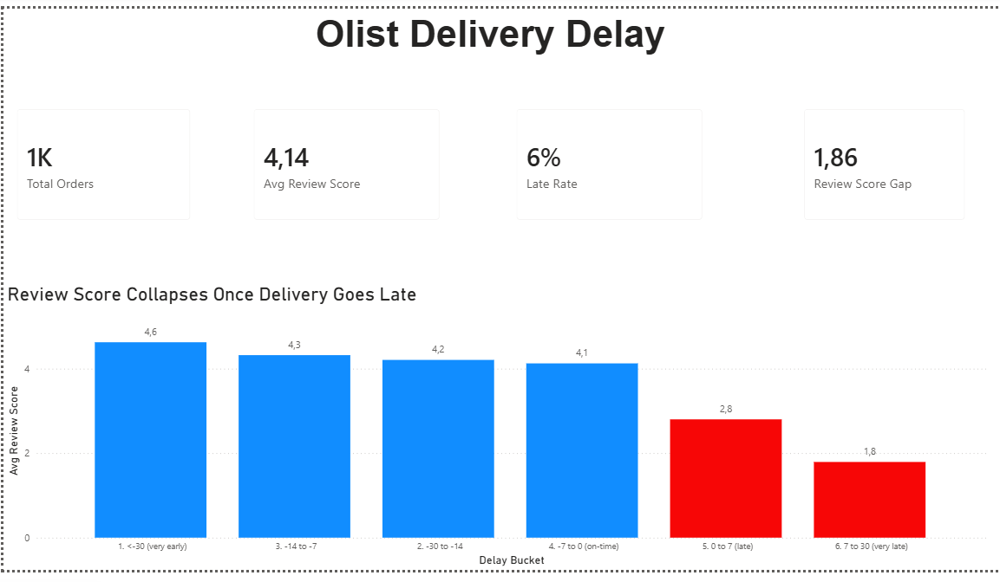
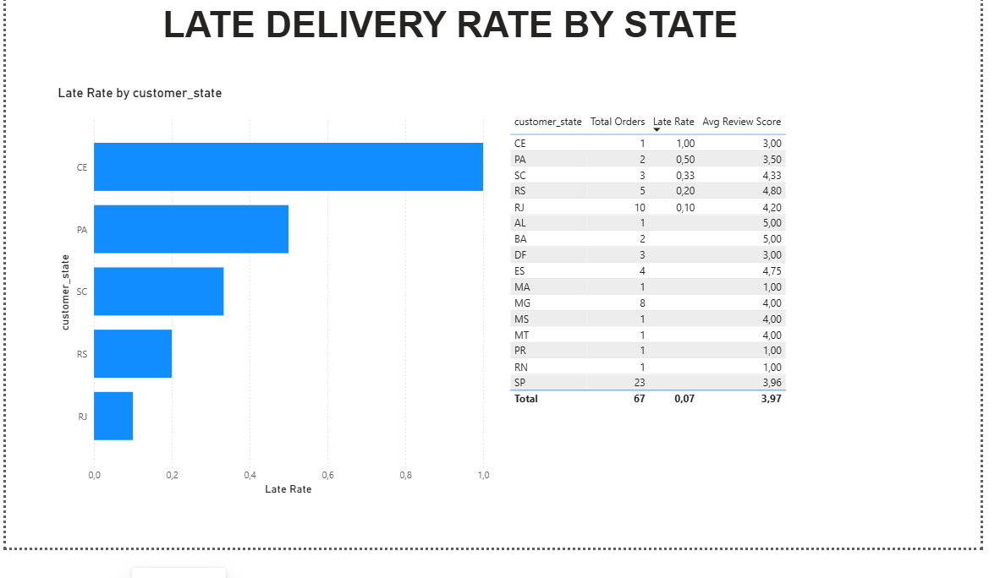
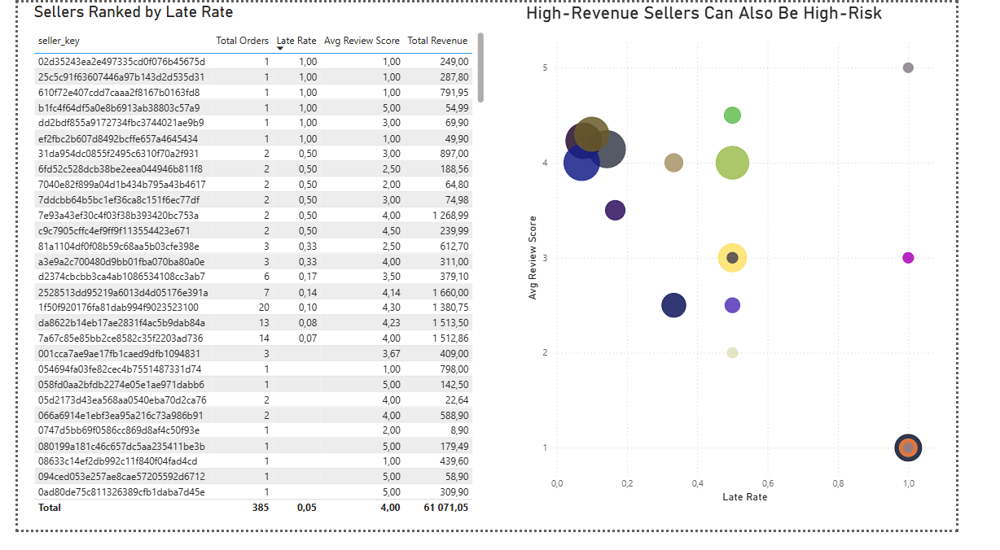

# Olist Delivery Delay Analysis

Analysis of delivered orders from the [Olist Brazilian E-Commerce dataset](https://www.kaggle.com/datasets/olistbr/brazilian-ecommerce), built with Databricks SQL and Power BI.

## Key finding

Late orders average **2.27★**, on-time orders average **4.29★** (full dataset, 96,470 orders — see `sql/05_analysis_queries.sql`). Review scores don't decline gradually with delay — they hold steady around 4.2–4.3 until an order goes late, then crash.

## Other findings (full dataset)

- **Geography:** late-delivery rate ranges from 21% (Alagoas) to 4% (Paraná)
- **Sellers:** 14 of ~794 active sellers have late rates over 20%, vs. a 6.8% platform average
- **Revenue at risk:** ~R$4,300–5,100 in estimated lost repeat-purchase revenue from late orders

## Dashboard

Built in Power BI, connected to a star schema exported from Databricks. Screenshots below.

**Note on sample size:** the SQL analysis above runs on the full 96,470-row dataset directly in Databricks. The Power BI dashboard, however, is built on a 1,000-row export sample (a Databricks Free Edition export limit) — so the dashboard's on-screen numbers (e.g. "1K Total Orders", 6% late rate) are illustrative of the same patterns at smaller scale, not an exact match to the full-dataset findings above. The headline pattern (review score cliff at the point of lateness) holds at both scales.

### Executive Summary


### Geography


### Sellers


## Stack

- **Databricks (SQL)** — cleaning, aggregation, and analysis on the full dataset
- **Power BI** — dashboard, built on a star schema (fact + dimension tables) exported as CSV
- **Python/pandas** — exploratory validation, cross-checked against the SQL results

## Structure

```
sql/          Databricks SQL scripts, run in order
powerbi/      dashboard.pbix
screenshots/  Dashboard page exports (used above)
notebooks/    Exploratory analysis (pandas)
```
